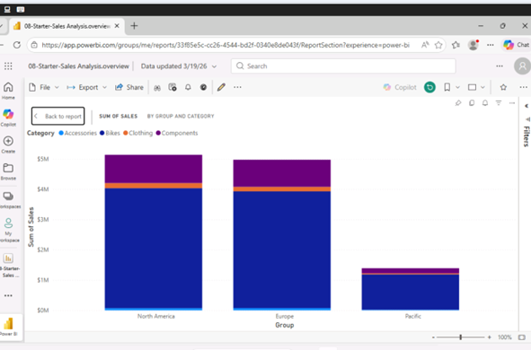
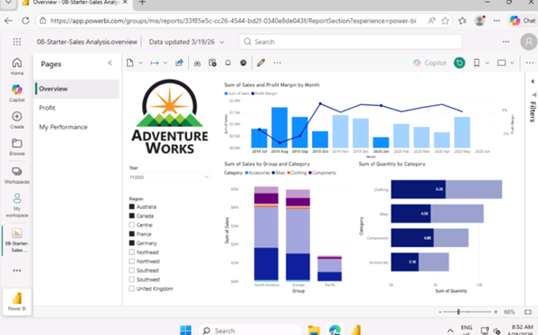

# Corporate Financial Performance Dashboard 📈

## 📌 Project Overview
This project showcases the development of a professional business intelligence tool. I focused on an **iterative design process**, moving from basic data visualization to a high-fidelity executive dashboard.

## 🛠 Tech Stack
- **Tool:** Power BI Desktop / Power BI Service
- **Features:** Sync Slicers, Visual Hierarchy, Cloud Publishing

## ⚙️ Key Technical Features
- **Design Iteration:** Created distinct UI designs to find the most effective way to communicate KPIs.
- **Sync Slicers:** Enabled cross-page filtering to ensure that when a user selects a "Region" or "Date" on Page 1, the entire report updates seamlessly.
- **Service Deployment:** Published the report to the **Power BI Service** cloud environment for professional sharing.

---
### 🔗 Quick Links
- [**View Final Dashboard Screenshot**]
  ### Design 1
  
  
  ### Design 2
  
  
- [**Back to Main Portfolio**](https://github.com/Elahehp)
